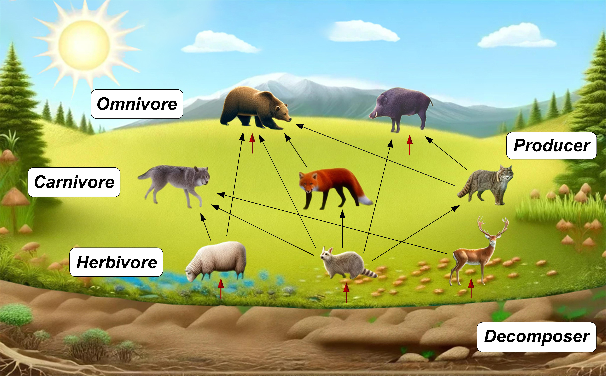

# Ecological Cycle Optimizer (ECO)

> A nature-inspired metaheuristic algorithm for nonlinear and non-convex global optimization.

<p align="center">
  <a href="https://arxiv.org/abs/2508.20458"></a>
  <a href="https://jxxsteven7.github.io/ECO-Optimizer/"></a>
  <a href="https://www.mathworks.com/matlabcentral/fileexchange/180852-ecological-cycle-optimizer-eco"></a>
</p>

<p align="center">
  <a href="https://arxiv.org/abs/2508.20458">Paper</a> &nbsp;|&nbsp;
  <a href="https://jxxsteven7.github.io/ECO-Optimizer/">Project page</a> &nbsp;|&nbsp;
  <a href="https://www.mathworks.com/matlabcentral/fileexchange/180852-ecological-cycle-optimizer-eco">MATLAB File Exchange</a>
</p>

**Boyu Ma**<sup>1,2,*</sup>, **Jiaxiao Shi**<sup>1,2,*</sup>, **Yiming Ji**<sup>1</sup>, and **Zhengpu Wang**<sup>1</sup>

<sup>1</sup> State Key Laboratory of Robotics and Systems, Harbin Institute of Technology, Harbin, China<br>
<sup>2</sup> School of Mechanical and Aerospace Engineering, Nanyang Technological University, Singapore 639798, Singapore<br>
<sup>*</sup> Equal contribution.



<a id="contents"></a>
## 📚 Contents

- [Overview](#overview)
- [Method at a Glance](#method-at-a-glance)
- [Repository Structure](#repository-structure)
- [Requirements](#requirements)
- [Quick Start](#quick-start)
- [Reproducing the Included Benchmark Runs](#reproducing-the-included-benchmark-runs)
- [Using ECO on a Custom Problem](#using-eco-on-a-custom-problem)
- [Experimental Scope in the Paper](#experimental-scope-in-the-paper)
- [Citation](#citation)
- [Contact](#contact)

<a id="overview"></a>
## 🌍 Overview

ECO models an optimization population as an ecological system. Its design is inspired by energy flow and material cycling among producers, consumers, decomposers, and nutrients. The algorithm combines complementary update mechanisms to maintain a dynamic balance between global exploration and local exploitation.

The codebase provides two MATLAB implementations:

- **`ECO for FEs`**: uses a maximum number of function evaluations (`MaxFEs`) as the termination criterion. Use this version for CEC-style comparisons with an evaluation-budget criterion.
- **`ECO for iterations`**: uses a maximum number of iterations (`Max_it`) as the termination criterion. Use this version for iteration-based experiments or direct applications.

<a id="method-at-a-glance"></a>
## 🧬 Method at a Glance

Each iteration includes the following ecological roles:

1. **Producers** absorb nutrients and provide guided candidate information.
2. **Consumers** consist of herbivores, carnivores, and omnivores with different predation-based update behaviours.
3. **Decomposers** recycle population information through optimal, local-random, and global-random decomposition.
4. **Selection** retains improved individuals and preserves the best solution found so far.

The recommended default configuration, determined by parameter sensitivity analysis on 23 classic benchmark functions, is:

```matlab
P_producer = 0.2;
P_herbivore = 0.3;
P_carnivore = 0.3;
% P_omnivore = 0.2;  % Remaining population proportion

P_opt = 0.6;
P_loc = 0.6;
```

`P_opt` controls optimal decomposition. When random decomposition is selected, `P_loc` controls the preference for local rather than global random decomposition.

<a id="repository-structure"></a>
## 🗂️ Repository Structure

```text
ECO-Optimizer/
|-- ECO for FEs/
|   |-- main.m                 # Reproduction script with MaxFEs termination
|   |-- ECO.m                  # Core ECO implementation
|   |-- Get_BenchFunctions.m   # 23 classic benchmark functions
|   |-- Boundmapping.m         # Boundary handling
|   |-- Pos_update.m           # Greedy position update
|   `-- Roulette.m             # Roulette-wheel selection
|-- ECO for iterations/
|   |-- main.m                 # Reproduction script with iteration termination
|   |-- ECO.m                  # Core ECO implementation
|   |-- Get_BenchFunctions.m   # 23 classic benchmark functions
|   |-- Boundmapping.m
|   |-- Pos_update.m
|   `-- Roulette.m
|-- assets/                    # Project-page figures and visual assets
|-- index.html                 # Project website
|-- project.css                # Project website styles
`-- README.md
```

<a id="requirements"></a>
## 🛠️ Requirements

- MATLAB R2023a (the code was developed in MATLAB R2023a).
- No additional MATLAB toolbox is required by the provided benchmark scripts.

<a id="quick-start"></a>
## 🚀 Quick Start

Clone the repository:

```bash
git clone https://github.com/jxxsteven7/ECO-Optimizer.git
cd ECO-Optimizer
```

Then open MATLAB, change to one of the following folders, and run `main.m`:

```matlab
cd('ECO for FEs');          % Function-evaluation version
run('main.m');
```

or

```matlab
cd('ECO for iterations');   % Iteration-based version
run('main.m');
```

The scripts automatically create a local `results/` directory and process the 23 classic benchmark functions (`F1`--`F23`).

<a id="reproducing-the-included-benchmark-runs"></a>
## 🔁 Reproducing the Included Benchmark Runs

### Function-evaluation version

Run `ECO for FEs/main.m` to use the CEC-style budget:

```matlab
Pop_size = 30;
Run_times = 10;
MaxFEs = 10000 * dim;
```

The script selects the function dimension and a compatible iteration count internally, then calls:

```matlab
[Best_pos, Best_fit, ECO_curve] = ...
    ECO(Pop_size, Max_it, MaxFEs, Low, Up, dim, fobj);
```

### Iteration-based version

Run `ECO for iterations/main.m` for a fixed number of iterations:

```matlab
Pop_size = 30;
Max_it = 500;
Run_times = 10;
```

The corresponding call is:

```matlab
[Best_pos, Best_fit, ECO_curve] = ...
    ECO(Pop_size, Max_it, Low, Up, dim, fobj);
```

### Outputs

For every function, both scripts write the following CSV files to their own `results/` folder:

- `Convergence_curve_classic_F*.csv`: one best-so-far convergence curve per independent run.
- `Best_pos_classic_F*.csv`: the best decision vector from each run.
- `Best_fit_classic_F*.csv`: the final best fitness value from each run.

The MATLAB command window also reports the minimum, mean, and standard deviation of the final fitness values.

<a id="using-eco-on-a-custom-problem"></a>
## 🧩 Using ECO on a Custom Problem

1. Define an objective function with the signature `fobj(x)`, where `x` is a row vector.
2. Specify the lower bound `Low`, upper bound `Up`, and dimension `dim`.
3. Call the version of `ECO.m` that matches the desired termination criterion.

For example, using the function-evaluation version:

```matlab
fobj = @(x) sum(x.^2);
Low = -100;
Up = 100;
dim = 30;

[Best_pos, Best_fit, Convergence_curve] = ...
    ECO(30, 5556, 10000 * dim, Low, Up, dim, fobj);
```

To add benchmark functions to the supplied scripts, update `Get_BenchFunctions.m` and add the corresponding identifier to `Function_list` in `main.m`.

<a id="experimental-scope-in-the-paper"></a>
## 📊 Experimental Scope in the Paper

The paper evaluates ECO in three stages:

1. **Parameter sensitivity analysis** on 23 classic functions to select the default population proportions and decomposition probabilities.
2. **Numerical benchmarking** against a 30-algorithm metaheuristic pool on CEC-2014 and CEC-2017, followed by detailed evaluation on CEC-2020.
3. **Engineering validation** on five constrained design problems from CEC-2020-RW.

For methodological details, experimental settings, and complete results, please see the [paper](https://arxiv.org/abs/2508.20458) and the [project page](https://jxxsteven7.github.io/ECO-Optimizer/).

<a id="citation"></a>
## 📖 Citation

If you use ECO or this implementation in your research, please cite:

```bibtex
@article{ma2025eco,
  title   = {Ecological Cycle Optimizer: A Novel Nature-Inspired Metaheuristic Algorithm for Global Optimization},
  author  = {Ma, Boyu and Shi, Jiaxiao and Ji, Yiming and Wang, Zhengpu},
  journal = {arXiv preprint arXiv:2508.20458},
  year    = {2025}
}
```

<a id="contact"></a>
## ✉️ Contact

For questions about the algorithm, implementation, or research collaboration, contact:

- Boyu Ma: [boyu.ma@ntu.edu.sg](mailto:boyu.ma@ntu.edu.sg)
- Jiaxiao Shi: [jiaxiao.shi@ntu.edu.sg](mailto:jiaxiao.shi@ntu.edu.sg)
